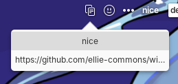

<div align="center">
  <h1 align="center">Clipboard indicator</h1>
  <h3 align="center">Simply display clipboard content in the elementary OS top bar</h3>
    <a href="https://elementary.io">
        
    </a>
</div>

<div align="center">
    <span align="center">
        
    </span>
</div>
</br>


## 🛣️ Roadmap

Install the deb file in release to install


## 🏗️ Building

Install dependencies with:

```bash
sudo apt install libglib2.0-dev libgranite-dev libwingpanel-dev valac meson
```

Run `meson` to configure the build environment and then `ninja` to build

```bash
meson build --prefix=/usr
cd build
ninja
```

To install

```bash
sudo ninja install
```

To uninstall, same but "uninstall"